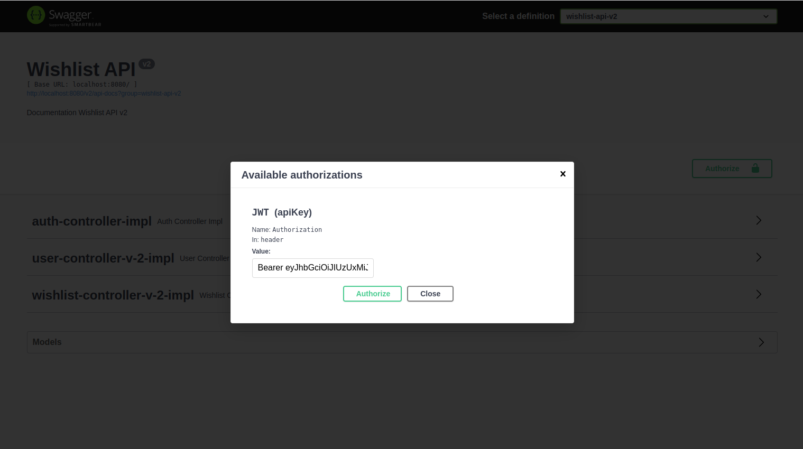
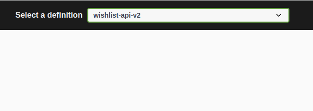
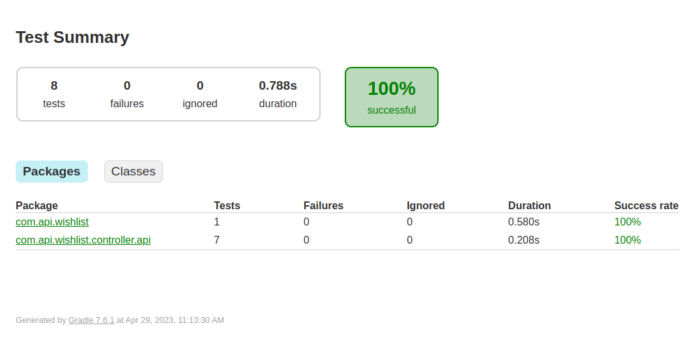

# wishlist-api
Desafio WishList

### Sobre

> Rest API wishlist ( lista de desejos )

- Java 17
- Spring Boot ( v.2.7.1 )
- Spring Security
- Gradle ( v.7.6.1)
- Swagguer - ( v.3 )

- Mongo DB


- Mockito
- JUnit ( v.5 )       - testes unitários
- Jacoco ( v.0.8.10 ) - para relatorios de cobertura dos testes
- Test Containers ( v1.18.0 )

### Versões

A api é disponibilizada em duas versões como um exemplo de versionamento da api.
Esse é um exemplo de como podemos garantir retrocompatibilidade durante atualizações e implementação
de nova features.

- V1 - todas as funcionalidades, **NÃO** possui autenticação
- V2 - todas as funcionalidades, **possui autenticação**

# Features

**Objetivo**: Api para gerenciar lista de sesejos de clientes, a principio essa api não faz a 
gestão de dados de usuarios ou produtos.

### 1 - Adicionar um produto na Wishlist do cliente

> POST: /api/{version}/registry

Para adicionar itens a lista de desejo de um usuario não é necessario um pré cadastro.

Uma vez que os dados são enviados todos os registro são devidamente atualizados.

*PAYLOAD*

```json
    {
      "userEmail": "string - email do user",
      "userName": "string - nome do usuario/customer",
      "userId": "string - identificador unico do usuario (max. 50 digitos)",
      "wishList": [
        {
          "productId": "string - identificador unico do produto (max. 50 digitos)",
          "description": "string - descricao do produto",
          "price": 100.0 // Decimal - valor do produto quando foi adicionado a lista
        }
      ]
    }
```

*COMO FUNCIONA??*

- maximo de 20 items por usuário
- Os items da lista **não são duplicados, ao enviar um id ja existente** (tanto para o user quanto o produto/item), 
o registro é atualizado/criado atraves do seu respectivo ID

*CONFIGS*

*ATENÇÃO*: os atributos `userEmail` e `userName` podem ser configruados com obrigatorio ou opicionais:

- `api.wishlist.validateUserEmailPattern`= SE `true`: valida o formato do email
- `api.wishlist.requiredUserEmailAndName`= SE `true`: torna obrigatorio nome e email


### 2 - Consultar todos os produtos da Wishlist do cliente

> GET: /api/{version}/{userId}

Retorna a wishlist completa de um usuário especifico, caso o usuario não possuir registro na wishlist retorna o status `NO_CONTENT`.

```json
{
  "userEmail": "string - email do user",
  "userName": "string - nome do usuario/customer",
  "userId": "string - identificador unico do usuario",
  "wishList": [
    {
      "productId": "string - identificador unico do produto",
      "description": "string - descricao do produto",
      "price": 100.0
    },
    ...
  ]
}
```

### 3 - Remover um produto da Wishlist do cliente

> PATCH: /api/{version}/remove-item

Para remover um item da Wishlist do cliente eviamos o ID unico do cliente e o ID unico do produto.

```json
{
  "productId": "string",
  "userId": "string"
}
```

### 4 - limpar Wishlist do cliente

> PUT: /api/v1/clear-user-wishlist

Remove todos os items da Wishlist do cliente 

```json
{
  "userId": "string"
}
```

### 5 - Consultar se um determinado produto está na Wishlist do cliente

> GET: /api/v1/search

Esse endpoint é destinado a consulta dinâmica, possibilitando obter visões diferentes de acordo com os filtros informados:

- page (query) - paginação ( numero da pagina solicitada )
- size (query) - paginação ( quantidade de registros por pagina - default 20 )

- productId (query) - filtro ( identificador unico do produto )
- userId (query) - filtro ( identificador unico do cliente )


### 6 - ( a partir da V2+ ) - geração de chave de acesso

> **ATENÇÃO:** todos os edpoints da Versão 2 da api precisao de autenticação para serem utilizados.

#### 6.1 - Gerando PASS KEY

> POST: /api/v2/auth/create-passkey

Esse endpoint gera uma chave unica que será utilizada para authenticação sistema na api.
É registro obrigatorio, a chave gerada aqui será utilizada para gerar o Bearer token ([sessão 6.2](#62---gerando-bearer-token)).

*REQUEST*
```json
{
  "name": "string - nome de identificação do serviço de consumo"
}
```

*RESPONSE*
```json
{
    "passKey": "b5d74b005e174619816579f0a14704d6"
}
```

#### 6.2 - Gerando Bearer Token

> POST: /api/v2/auth/signup

Esse endpoint gera o tokem de autorização para acesso aos endpoints protegisdos da v2.

*REQUEST*
```json
{
  "passKey": "e2c361f31b4a4548a372c96303f8a42e"
}
```

*RESPONSE*
```json
{
  "accessToken": "eyJhbGciOiJIUzUxMiJ9.eyJzdW....",
  "tokenType": "Bearer",
  "id": "644d1ca454ac9923ba1f3f5a"
}
```

### 7 - API DOC

Para documentação da api foi utilizado o [Swagger 3.0](https://swagger.io/docs/specification/2-0/what-is-swagger/).

Com o Swagger podemos também interagir com todos os endpoints da aplicação, inclusive com os que necessitam de autenticação.


**Agumas dicas que podem ajuda:**

- No canto superior direito da tela do swaguer é possivel alterar entre as versções da aplicação.



- Quando selecionamos a Versão 2 da api podemos nos authenticar com o token gerado na [Sessão 6.2](#62---gerando-bearer-token)




# Deploy

Esse projeto vai com o Gradle embarcado não havendo necessidade de instalação de plugin adicional para buidl da api.

*** é necessário ter o java 17 instalado na maquina do build.

### Gradle version

> gradlew --version

### Build

> gradlew clean

> gradlew build

### Jacoco Reports

No build do projeto também é gerado o realtorio de combertura de testes.

> build/reports/tests/test/index.html

Ao abrir o arquivo html diretamente em qualquer navegador, será apresentado algo semelhante a imagem abaixo:




# Run

### Docker image

> zherro/wishlist-api:latest

### Development

Para inciar uma imagem docker mongodb com o mongo xpress ja configurado utilize o arquivo: 
[docker compose mongo db](setup-local/docker-compose-mongodb.yml)

```shell
docker compose -f setup-local/docker-compose-mongodb.yml up -d

# Output ports

# mongoDB: 27017
# Mongo Express: 8889
```

### Mock

Para inciar uma imagem docker da api Wishlist, com mongodb e mongo xpress ja configurado utilize o arquivo:
[docker compose mongo db](setup-local/docker-compose-mock-wishlist-api.yml)

```shell
 docker compose -f setup-local/docker-compose-mock-wishlist-api.yml up -d

# Output ports

# mongoDB: 27017
# Mongo Express: 8899

# Wishlist API: 9090
```